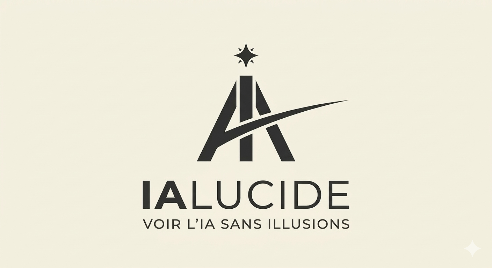
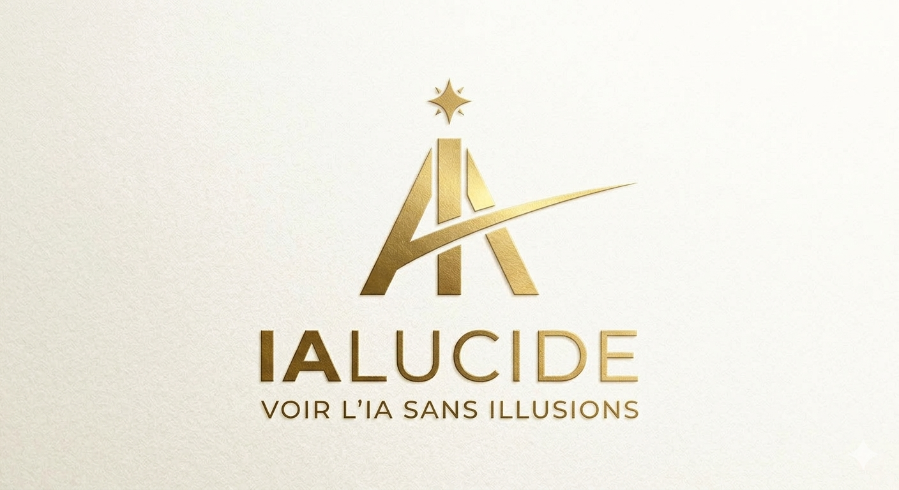

# ialucide — Newsletter Design System (Beehiiv)

>  Référence visuelle pour toutes les éditions. À consulter avant chaque création.

---

## Logos de référence

### Version noir — fond clair (parchemin, blanc)

- Fichier : `ialucide_logo_black_fonts.png`
- Usage : fond clair (parchemin `#f4f0e8`, blanc)
- Éléments : monogramme IA + swoosh noir · "IALUCIDE" bold caps · "VOIR L'IA SANS ILLUSIONS" spaced caps
- Contexte : documents PDF, supports print, fond parchemin

### Version or — fond noir

- Fichier : `ialucide_logo_gold.png`
- Usage : fond noir `#0e0e0e`
- Éléments : monogramme IA + swoosh or `#c9a84c` · "IALUCIDE" or · "VOIR L'IA SANS ILLUSIONS" or
- Contexte : footer newsletter Beehiiv, image hero, supports dark mode

### Règles d'usage
- **Jamais** logo noir sur fond noir, logo or sur fond clair
- **Toujours** pleine largeur en footer newsletter (centré)
- **Monogramme seul** (IA + étoile) utilisable en watermark sur images hero (coin bas droit)
- Espace de respiration minimum : équivalent à la hauteur de l'étoile de chaque côté

---

## Couleurs

| Rôle | Valeur | Usage |
|---|---|---|
| Fond principal | `#0e0e0e` noir quasi-pur | Body email, hero, footer |
| Or | `#c9a84c` | Titres hero, CTAs, accents, logo |
| Parchemin | `#f4f0e8` | Non utilisé en NL (usage site) |
| Bleu abysses | `#1a3a4a` | Non utilisé en NL |
| Gris | `#6b6b6b` | Corps de texte secondaire |
| Blanc | `#ffffff` | Texte principal sur fond noir |

**Règle** : fond noir partout sauf le footer Beehiiv (géré automatiquement).

---

## Typographie

| Élément | Police | Graisse | Taille approx. |
|---|---|---|---|
| Titre hero (image) | Sans-serif bold caps | Extra-bold / Black | 48-60px |
| Sous-titre image | Sans-serif | Regular | 18-22px |
| Numéro édition | Sans-serif | Regular | 14px |
| Titre email (pre-header) | Sans-serif | Bold | 22-26px |
| Corps texte | Sans-serif | Regular | 16px |
| Titre section | Sans-serif | Bold | 22-28px |
| Label section | Sans-serif | Regular italic | 14px |

**Hiérarchie couleur texte** :
- Titre hero image : blanc + or (alternance ou combinaison)
- Sous-titre : blanc ou gris clair
- Corps : blanc sur fond noir
- CTAs : texte blanc ou noir sur bouton or

---

## Structure d'une édition

### 1. Header email
- Date + lien "Lire en ligne" (droite)
- **Titre** : accrocheur, affirmatif, sans point d'interrogation si possible
- **Sous-titre** : toujours "L'IA sans jargon, sans fantasme."

### 2. Image hero (pleine largeur)
- **Fond** : noir `#0e0e0e`
- **Texte** : 2 lignes — ligne 1 blanc bold caps / ligne 2 or bold caps
- **Mention** : "Edition #N | [Nom du thème]" en bas à gauche (blanc, regular)
- **Logo** : monogramme ialucide or en bas à droite
- Format : 1200×600px recommandé, pleine largeur email

### 3. Accroche
Bonjour à tous,
[2-3 phrases d'intro directes. Pas de promesse. Un constat.]

### 4. Outil recommandé
Structure fixe :
- **Titre** : "🔧 L'outil de la semaine : [Nom]" ou titre accrocheur
- **Description** : 2-3 phrases factuelles, sans superlatifs
- **Bullets** (3 max) :
  - Feature 1
  - Feature 2
  - Gain de temps estimé : Xh par semaine
- **CTA** : bouton or centré → "Tester [Nom] →"

### 5. Dossiers site
Les dossiers à ne pas manquer sur le site
Pour ceux qui souhaitent aller plus loin :
- 2 boutons or centrés → liens vers articles ialucide.fr
- Libellés courts : "[Métier] : [angle court]"

### 6. Analyse du moment
- **Titre** : percutant, affirmatif, 1-2 lignes
- **Corps** : 3-5 paragraphes courts, 100% factuel, sources nommées
- **Ton** : ni catastrophiste ni rassurant — constater et analyser
- Image optionnelle si elle illustre sans commenter

### 7. Conclusion
[Question ou invitation courte]
D'ici là, restez lucides.
L'équipe ialucide

### 8. Footer
- Logo ialucide pleine largeur, fond noir, texte or
- "VOIR L'IA SANS ILLUSIONS" en sous-titre
- Mentions légales Beehiiv automatiques

---

## Boutons CTA

| Type | Fond | Texte | Bordure |
|---|---|---|---|
| Principal (outil) | `#c9a84c` or | Blanc ou noir | Aucune |
| Secondaire (dossiers) | `#c9a84c` or | Blanc ou noir | Aucune |

- **Zéro border-radius** (cohérence avec le design site)
- Centré, largeur auto
- Flèche → en fin de libellé pour les CTAs primaires

---

## Ton éditorial

- **Direct** : sujet → analyse → conclusion. Pas de ménagement.
- **Factuel** : chiffres, noms d'entreprises, sources identifiables.
- **Zéro évangélisme** : ne jamais dire que l'IA "va révolutionner" quoi que ce soit.
- **Zéro catastrophisme** : ne jamais dire qu'un métier "va disparaître".
- **Signature** : toujours "L'équipe ialucide" (pas "Daniel Rollin" en NL).

---

## Assets récurrents

- **Logo monogramme** : IA + étoile, or sur fond noir — watermark image hero
- **Logo full** : IALUCIDE + "VOIR L'IA SANS ILLUSIONS" — footer uniquement
- **Palette image hero** : fond noir, typographie caps sans-serif, accent or

---

## Historique des éditions

| # | Date | Sujet | Outil recommandé | Angle analyse |
|---|---|---|---|---|
| 2 | 6 mai 2026 | Vos données dans ChatGPT : ce que vous acceptez vraiment | Mistral Le Chat Pro | ChatGPT entraîne ses modèles sur vos conversations — sauf si vous l'en empêchez |

---

## Checklist avant envoi

- [ ] Sous-titre = "L'IA sans jargon, sans fantasme."
- [ ] Image hero : fond noir + numéro d'édition + monogramme or
- [ ] Accroche commence par "Bonjour à tous,"
- [ ] 1 outil avec bullets + CTA or
- [ ] 2 boutons dossiers vers ialucide.fr
- [ ] Analyse factuelle avec sources nommées
- [ ] Conclusion = "D'ici là, restez lucides. / L'équipe ialucide"
- [ ] Footer logo fond noir présent
